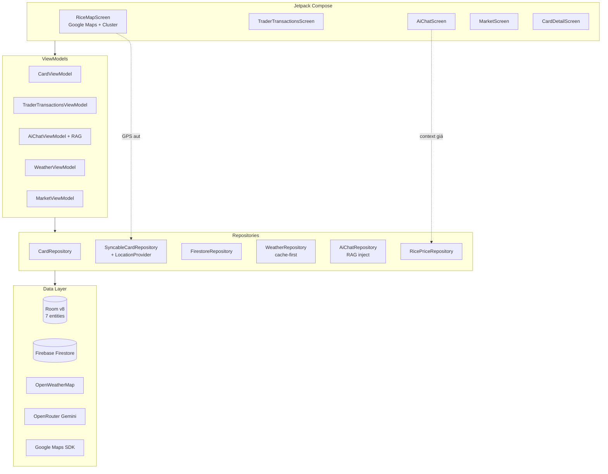

# 🌾 Cân Lúa Mobile — Nền tảng Nông nghiệp Thông minh

> Hệ sinh thái khép kín cho **Nông dân** và **Thương lái**: số hoá quá trình cân lúa thực địa, theo dõi giá thị trường, tham vấn AI khuyến nông và bản đồ vệ tinh điểm thu mua. Triết lý **Offline-First**, hoạt động mượt ngoài đồng ngay cả khi mất sóng.

---

## 🌟 Tính năng đã hoàn thiện

### 1. Cân Lúa & Chốt Giao Dịch (Sprint 1–4)
- **Tính toán real-time** Khối lượng thực = `Tổng - (Số bao × Trừ bì) - Tạp chất - Tổng × (Độ ẩm/100)`.
- **Bảng cân phân trang ngang** (3-Card layout, nhảy ô column-major C1→C2…) tránh cuộn dài, tăng tốc nhập liệu.
- **Offline-First** với Room Database; tự đồng bộ Firebase Firestore khi có mạng (WorkManager).
- **QR Handshake** xác thực giao dịch giữa Nông dân ↔ Thương lái bằng SHA-256, khoá thẻ sau khi chốt.
- **Text-to-Speech tiếng Việt** đọc số khi nhập, rảnh tay kiểm tra.
- **Auto GPS capture**: thẻ tạo ngoài đồng tự ghi lại toạ độ (Phase 2.6).

### 2. Phân quyền FARMER / TRADER (Sprint 5)
- Hai role hoàn toàn khác luồng: FARMER quản lý vụ thu hoạch, TRADER quản lý sổ thu mua + giá thầu.
- Dialog setup hồ sơ sau lần đăng ký đầu (`ProfileSetupScreen`).
- 4 tab riêng cho TRADER: **Đặt giá** (`TraderBidsScreen`), **Sổ giao dịch** (`TraderTransactionsScreen`), **Bản đồ thu mua** (`RiceMapScreen`), **Hồ sơ** (`TraderProfileScreen`).

### 3. Module Thị Trường (Phase 2.1 → 2.2)
- **Bảng giá lúa realtime** từ Firestore: TRADER nhập giá thật, FARMER xem live + lọc theo giống.
- **Vico Chart** vẽ xu hướng giá 7 ngày, có animation enter.
- **Filter chips** theo giống lúa (ST25, OM18, Jasmine 85…) cập nhật theo `getDistinctRiceVarieties`.

### 4. Thời tiết Offline-First (Phase 2.3)
- OpenWeatherMap API + GPS định vị.
- Cache vào Room (singleton `WeatherCache`, TTL 10 phút), badge **"Đã lưu · N phút trước"** khi stale.
- Strategy cache-first → refresh in background.

### 5. AI Chat Khuyến Nông (Phase 2.3 → 2.4)
- Backend: OpenRouter (Gemini Flash free).
- **RAG nhẹ** inject top-5 giá lúa hôm nay vào system prompt — AI trả lời có dẫn số liệu thật.
- **Markdown parser tự viết** (~80 dòng) render `**bold**` / `*italic*` / `` `code` `` không phụ thuộc thư viện.
- **Voice Input STT** với `SpeechRecognizer` API + pulse animation, partial result realtime.
- **IME-aware**: bàn phím không che input/header (`statusBarsPadding` + `imePadding`).

### 6. Sổ Giao Dịch Trader (Phase 2.5)
- `observeMyTraderCards` + `observeTransactionsForCards` qua `flatMapLatest` → realtime stream.
- Hero stats card gradient với progress bar % thanh toán + 4 filter chips (Tất cả / Tuần / Tháng / Còn nợ).
- Format tiền thông minh: tỷ / tr / k cho metric box, full vi-VN cho hero.

### 7. Bản Đồ Thu Mua (Phase 2.6 — mới nhất)
- **Google Maps Compose 6.4.1** với `MapType.HYBRID` (vệ tinh + đường) — nhìn rõ cánh đồng.
- **Clustering** built-in của `maps-compose-utils` đảm bảo 60+fps khi zoom out có nhiều marker.
- **ModalBottomSheet premium** khi tap marker: avatar, KL/Bao, badge giống lúa, CTA "Vào Nhập Cân".
- **EmptyMapHint** thông minh phân biệt: chưa có quyền vs chưa có thẻ nào có toạ độ.
- Auto GPS capture trong `SyncableCardRepository.insertCard`.

### 8. UX Polish (Sprint 6)
- **Auto-hide FAB** scroll-aware ở CardList, CardDetail, TraderBids.
- **Refactor deprecation toàn dự án**: `Icons.AutoMirrored`, `MenuAnchorType`, `@param:ApplicationContext`, `LocalLifecycleOwner` mới.
- **Dynamic Theme** Light/Dark mượt mà với `animateColorAsState` cho từng token.

### 9. NewsFeed & Knowledge Base (Phase 2.7 — mới nhất)
- **RSS Feed đa nguồn**: Google News + Báo Nông Nghiệp VN, parse XML thủ công.
- **Room cache offline-first**: bảng `news_articles`, sync background, badge "Đã lưu".
- **Auto-classify** bài (Lúa / Gạo / Thời tiết / Thị trường) qua keyword heuristic.
- **Chrome Custom Tabs** mở bài mượt mà, không rời app.
- **Knowledge Base AI**: `agronomy_knowledge.json` inject vào system prompt → AI trả lời dựa trên dữ liệu canh tác lúa ĐBSCL tin cậy.
- **Context-aware AI**: gửi tên user, vị trí GPS, giống lúa đang theo dõi cho AI mỗi lượt chat.

### 10. UI Modern Refresh (Phase 2.8)
- **Floating Pill Bottom Bar**: capsule bo 32dp lơ lửng, item active expand thành pill ngang chứa icon filled + label, item idle chỉ icon outlined. Spring animation + haptic feedback.
- **Pull-to-Refresh** trên tab Thị Trường + News.
- **Shimmer Loading** thay placeholder khi mạng yếu.
- **AuthStateListener**: chuyển `FirebaseAuth` thành Single Source of Truth → sign-in/sign-out tự điều hướng đúng, không cần restart app.
- **AI Chat IME insets** fix triệt để: `imePadding()` ở Column root + `windowSoftInputMode=adjustResize` → input bar follow keyboard mượt, không gap thừa.

---

## 🛠 Tech Stack

| Lớp | Công nghệ |
|---|---|
| **Ngôn ngữ** | Kotlin 2.0+ |
| **UI** | Jetpack Compose + Material 3 + Fluent Design tokens |
| **Architecture** | MVVM + Clean Architecture |
| **DI** | Hilt / Dagger |
| **Local DB** | Room (v9 — 8 entities + migration chain 1→9) |
| **Cloud** | Firebase Auth + Firestore + WorkManager sync |
| **Network** | OkHttp + Gson (singleton `HttpClient`) |
| **AI** | OpenRouter (Gemini Flash) + RAG inject prompt |
| **Maps** | Google Maps Compose 6.4.1 + Clustering utils |
| **Voice** | Android `SpeechRecognizer` + TTS native |
| **QR** | CameraX + ML Kit Barcode Scanning |
| **Charts** | Vico Compose |
| **News** | RSS XML parser + Chrome Custom Tabs (`androidx.browser:1.8.0`) |
| **Image** | Coil Compose 2.6.0 |
| **Permissions** | Accompanist Permissions |

---

## 📱 Thiết kế Giao diện

- **Bảng màu:** Xanh lá lúa `#2E7D32` (primary) + Vàng lúa chín `#F9A825` (accent) + Fluent layering (Acrylic/Shadow/SurfaceContainer).
- **Touch target ≥ 48dp**, contrast cao đọc rõ ngoài nắng.
- **Haptic Feedback** ở thao tác quan trọng (lưu, xoá, quét QR, chốt giao dịch).
- **Font Scale Accessibility**: dùng `MaterialTheme.typography` thay vì size cố định, không vỡ layout khi phóng chữ hệ thống.

---

## 🚀 Cài đặt & Chạy

### Yêu cầu
- Android Studio Ladybug+
- JDK 17
- Thiết bị / Emulator API 24+

### Bước 1 — Clone
```bash
git clone https://github.com/YourUsername/CanLuaMobile.git
cd CanLuaMobile
```

### Bước 2 — Cấu hình `local.properties`
Tạo / sửa file `local.properties` ở root project:
```properties
sdk.dir=C:\\Path\\To\\Android\\Sdk

# OpenWeatherMap (https://openweathermap.org/api)
OPENWEATHER_API_KEY=your_openweathermap_key

# OpenRouter (https://openrouter.ai/keys) — model gemini-2.0-flash-exp:free
OPENROUTER_API_KEY=your_openrouter_key

# Google Maps (https://console.cloud.google.com/google/maps-apis)
# Bật "Maps SDK for Android"
MAPS_API_KEY=your_google_maps_key
```

> [!IMPORTANT]
> App vẫn build/run được khi keys rỗng (graceful degradation), nhưng các module Weather / AI / Map sẽ vô hiệu.

### Bước 3 — Firebase
Đặt `google-services.json` vào `app/`.

### Bước 4 — Build
```bash
./gradlew :app:assembleDebug
# hoặc Run trong Android Studio (Shift+F10)
```

---

## 🗓 Roadmap

### ✅ Đã hoàn thành
| Phase | Module |
|---|---|
| Sprint 1–4 | Core cân lúa + QR + offline sync |
| Sprint 5 | Role-based FARMER / TRADER |
| Sprint 6 | Voice STT + UX polish + deprecation cleanup |
| Phase 2.1 | Module Thị Trường read-only + Vico chart |
| Phase 2.2 | TRADER nhập giá thật + FARMER xem realtime |
| Phase 2.3 | Weather GPS + AI Chat OpenRouter |
| Phase 2.4 | RAG inject + Markdown parser + IME insets |
| Phase 2.5 | TraderTransactionsScreen realtime |
| Phase 2.6 | RiceMapScreen Google Maps + Clustering |
| Phase 2.7 | NewsFeed RSS + Knowledge Base AI + AuthListener |
| Phase 2.8 | Floating Pill Bottom Bar + Pull-to-Refresh + Shimmer + IME fix triệt để |

### 🔜 Sprint 7 (kế hoạch)
- **Custom marker icon** màu theo trạng thái thẻ (free / locked / paid).
- **Heat-map** mật độ thu mua thay marker khi quá nhiều điểm.
- **FARMER filter** dropdown theo khu vực + giống lúa.
- **Weather forecast 5 ngày** thay vì chỉ hiện tại.
- **Voice TTS đọc reply AI** cho UX rảnh tay hoàn toàn.
- **Geofencing** cảnh báo khi vào vùng có giá tốt.

### 🌐 Roadmap dài hạn
- **AI ViT5 hệ tóm tắt tin tức** thị trường lúa từ báo nông nghiệp (đang nghiên cứu).
- **Marketplace P2P** Nông dân ↔ Thương lái có rating + escrow.
- **Multi-tenant**: HTX / doanh nghiệp xuất khẩu thấy báo cáo gộp nhiều thẻ.
- **Hardware integration**: cân điện tử Bluetooth tự bắn weight về app.
- **Web Dashboard**: trang quản trị cho HTX xem tổng quan tỉnh / huyện.
- **Export PDF**: in phiếu cân chuẩn nhà nước, ký số.
- **i18n**: Khmer / Lào cho thị trường ĐBSCL biên giới.

---

## 📊 Kiến trúc tổng thể



---

## 📂 Cấu trúc thư mục

```
app/src/main/java/com/GiaThinh/canlua/
├── data/
│   ├── dao/               # Room DAOs
│   ├── database/          # AppDatabase, migrations
│   ├── firestore/         # Firestore data classes
│   ├── location/          # FusedLocationProvider wrapper
│   ├── model/             # Card, WeightEntry, Transaction, ...
│   └── remote/            # OkHttp client + APIs
├── repository/            # Single source of truth layer
├── ui/
│   ├── component/         # Reusable Compose components
│   ├── navigation/        # NavHost + transitions
│   ├── screen/
│   │   ├── aichat/        # AI Chat
│   │   ├── dashboard/     # Stats charts
│   │   ├── map/           # RiceMapScreen ⭐ Phase 2.6
│   │   ├── market/        # Bảng giá thị trường
│   │   ├── qr/            # QR Generate / Scan
│   │   └── trader/        # Trader-specific screens
│   ├── theme/             # AppColors, Typography, Theme
│   └── viewmodel/         # MVVM bridges
├── util/                  # RiceCalculator, formatters
└── di/                    # Hilt modules
```

---

## 🤝 Giấy phép & Tác giả

- **Phát triển bởi:** Gia Thịnh
- **Bản quyền:** Thuộc sở hữu nội bộ. Không sao chép thương mại khi chưa được phép.
- **Liên hệ kỹ thuật:** mở Issue trên GitHub.
