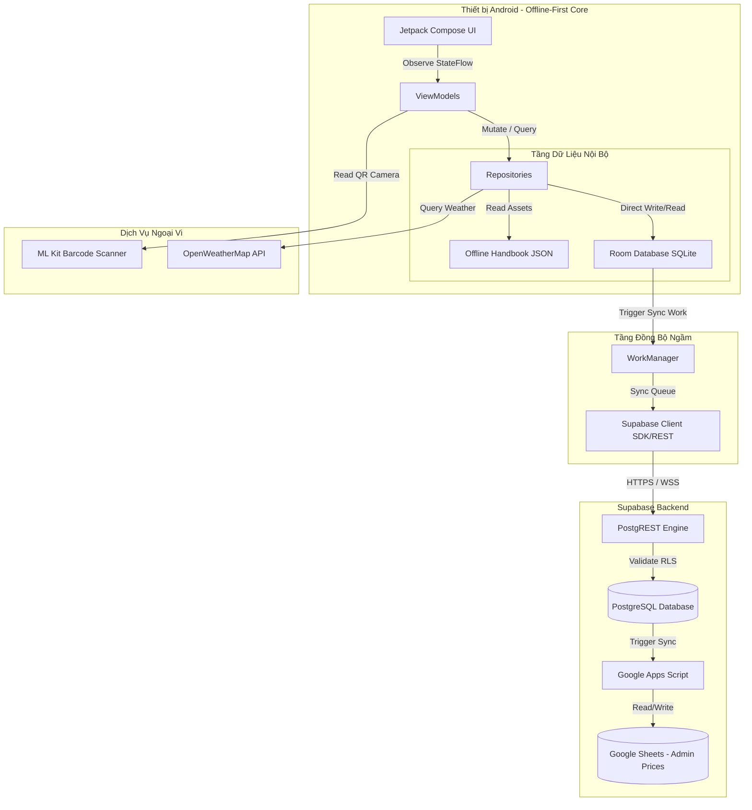
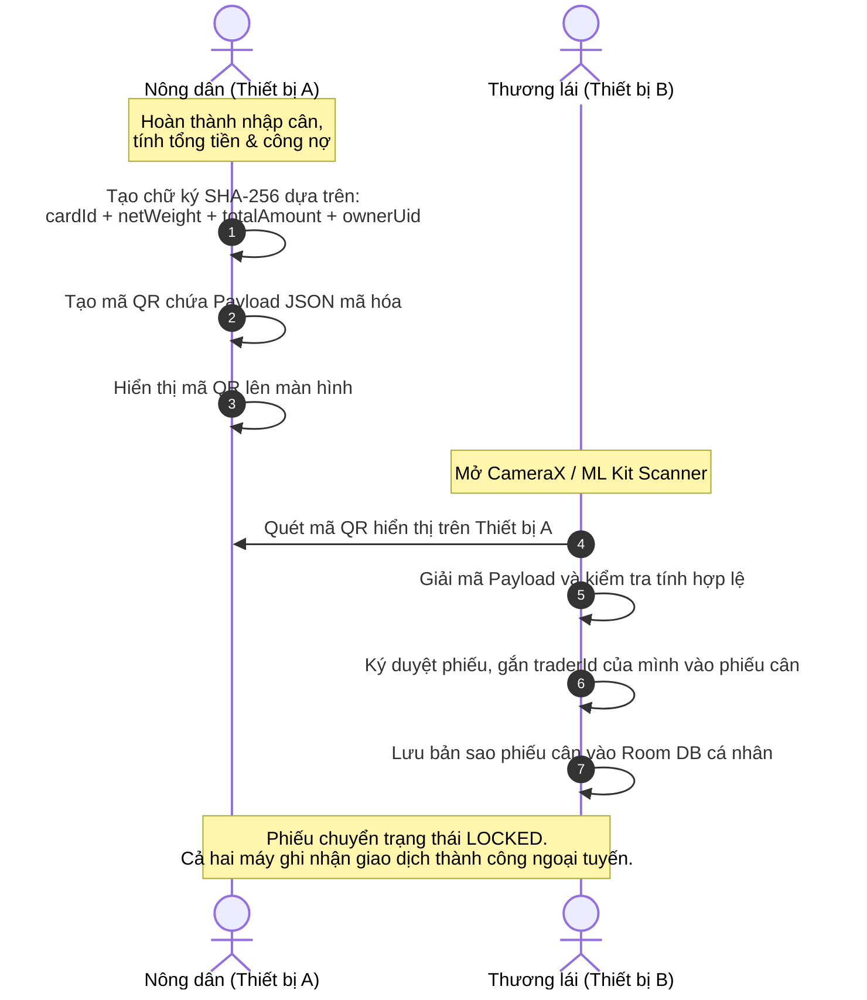

# Cân Lúa Mobile — Architectural North Star (Kim Chỉ Nam Kiến Trúc)

Tài liệu này là nguồn chân lý duy nhất (Single Source of Truth - SSOT) mô tả thiết kế kiến trúc hệ thống, luồng dữ liệu cốt lõi, cơ chế bảo mật và giao thức tích hợp của ứng dụng **Cân Lúa Mobile**. Hệ thống được thiết kế theo tư duy **Local-First / Offline-First**, tối ưu hóa hiệu năng, giảm thiểu sự phụ thuộc vào mạng Internet và đảm bảo an toàn dữ liệu tài chính cho nông dân và thương lái tại Đồng bằng sông Cửu Long.

---

## 1. Tầm Nhìn & Nguyên Tắc Thiết Kế (Vision & Design Principles)

Kiến trúc ứng dụng tuân thủ nghiêm ngặt các nguyên tắc thiết kế thực chiến dưới đây:

*   **Local-First làm trọng tâm:** Mọi thao tác nghiệp vụ cốt lõi (tạo phiếu, nhập bao cân, tính toán tài chính, kết nối QR) phải thực hiện trực tiếp và lưu trữ an toàn trong cơ sở dữ liệu local (Room DB). Ứng dụng không bao giờ chặn hành vi của người dùng do lỗi kết nối mạng.
*   **Trải nghiệm không đăng nhập bắt buộc (Zero-Barrier Guest Mode):** Người dùng có thể tải ứng dụng và bắt đầu cân lúa ngay lập tức mà không cần kết nối mạng hay tạo tài khoản đám mây. Thông tin hồ sơ được lưu cục bộ và chỉ đồng bộ lên đám mây khi người dùng chọn sao lưu.
*   **Chuyển đổi hoàn toàn sang Supabase:** Thay thế toàn bộ hạ tầng Firestore cũ bằng Supabase (PostgreSQL) để đồng bộ dữ liệu phi tập trung, tận dụng cơ chế Row-Level Security (RLS) mạnh mẽ và giảm độ trễ truy vấn.
*   **Bảo mật tại ranh giới thiết bị:** Mã hóa các thông tin nhạy cảm của người dùng (như số CCCD) ngay tại local trước khi thực hiện đồng bộ. QR Handshake sử dụng cơ chế ký số SHA-256 để bảo vệ tính toàn vẹn của phiếu cân.
*   **Degrade thông minh:** Khi ngoại tuyến hoàn toàn, hệ thống tự động ẩn các tính năng đám mây, sử dụng dữ liệu thị trường đã cache, hiển thị Cẩm nang Nông nghiệp tĩnh và chuyển sang chế độ xếp hàng đồng bộ ngầm.

---

## 2. Lược Đồ Kiến Trúc Hệ Thống (System Architecture)

Luồng hoạt động của hệ thống được tổ chức theo mô hình MVVM (Model-View-ViewModel) kết hợp Clean Architecture và Repository Pattern:



---

## 3. Cấu Trúc Thực Thể Dữ Liệu Lồng Nhau (Data Schema & Entities)

Các thực thể dữ liệu được định nghĩa bằng YAML để mô tả chính xác cấu trúc quan hệ, các trường lồng nhau sâu (hơn 3 cấp độ) phục vụ cho quá trình ánh xạ (mapping) giữa Room DB và Supabase PostgreSQL.

```yaml
database_specification:
  version: "2026.06.30"
  engine:
    local: "Room DB SQLite 2.8.1"
    cloud: "Supabase PostgreSQL (via PostgREST)"
  
  entities:
    profiles:
      description: "Lưu thông tin hồ sơ của người dùng (cả local và cloud)"
      fields:
        id: "UUID PRIMARY KEY (Supabase auth.users.id hoặc Local UUID cho Guest)"
        name: "TEXT (Họ và tên người dùng)"
        phone: "VARCHAR(15) UNIQUE"
        role: "VARCHAR(10) CHECK (role IN ('FARMER', 'TRADER', 'GUEST'))"
        region: "TEXT (Khu vực canh tác/thu mua)"
        encrypted_cccd: "TEXT (Số CCCD đã được mã hóa AES-256 nội bộ)"
        is_premium: "BOOLEAN DEFAULT FALSE"
        created_at: "BIGINT (Timestamp epoch)"
        updated_at: "BIGINT (Timestamp epoch)"
        sync_status: "VARCHAR(10) CHECK (sync_status IN ('SYNCED', 'PENDING', 'LOCAL_ONLY'))"

    cards:
      description: "Phiếu cân lúa chính"
      fields:
        id: "UUID PRIMARY KEY"
        owner_uid: "UUID REFERENCES profiles(id) (Người tạo phiếu)"
        counterparty_name: "TEXT (Tên đối tác nông dân/thương lái)"
        counterparty_phone: "VARCHAR(15) (SĐT đối tác)"
        rice_variety: "TEXT (Giống lúa, ví dụ: ST25, OM5451)"
        season: "TEXT (Vụ mùa, ví dụ: ĐX'26, HT'26)"
        price_per_kg: "DOUBLE PRECISION (Đơn giá thỏa thuận)"
        bag_weight_empty: "DOUBLE PRECISION (Khối lượng bì mặc định của bao)"
        impurity_weight: "DOUBLE PRECISION (Khối lượng tạp chất trừ đi)"
        moisture_percent: "DOUBLE PRECISION (Phần trăm độ ẩm)"
        is_locked: "BOOLEAN DEFAULT FALSE (Trạng thái chốt khóa phiếu qua QR)"
        handshake_trader_id: "UUID REFERENCES profiles(id) (ID thương lái xác thực)"
        gps_latitude: "DOUBLE PRECISION NULL"
        gps_longitude: "DOUBLE PRECISION NULL"
        created_at: "BIGINT (Timestamp epoch)"
        updated_at: "BIGINT (Timestamp epoch)"
        sync_status: "VARCHAR(10) CHECK (sync_status IN ('SYNCED', 'PENDING', 'DELETED_PENDING'))"
      nested_calculations:
        total_bags: "COUNT(weight_entries)"
        total_raw_weight: "SUM(weight_entries.weight)"
        net_weight: "(total_raw_weight - (total_bags * bag_weight_empty) - impurity_weight) * (1.0 - (moisture_percent - 14.0) * 0.01)"
        total_amount: "net_weight * price_per_kg"

    weight_entries:
      description: "Chi tiết từng bao cân lúa trong phiếu"
      fields:
        id: "UUID PRIMARY KEY"
        card_id: "UUID REFERENCES cards(id) ON DELETE CASCADE"
        table_index: "INT (Chỉ số bảng cân lúa, ví dụ: Bảng 1, Bảng 2)"
        cell_index: "INT (Chỉ số ô cân trong lưới 5x5, từ 0 đến 24)"
        weight: "DOUBLE PRECISION (Khối lượng bao cân thực tế)"
        created_at: "BIGINT"
        sync_status: "VARCHAR(10)"

    transactions:
      description: "Nhật ký thanh toán và công nợ liên kết với phiếu cân"
      fields:
        id: "UUID PRIMARY KEY"
        card_id: "UUID REFERENCES cards(id) ON DELETE CASCADE"
        amount: "DOUBLE PRECISION (Số tiền thanh toán)"
        transaction_type: "VARCHAR(10) CHECK (transaction_type IN ('DEPOSIT', 'PAYMENT'))"
        payment_method: "VARCHAR(10) CHECK (payment_method IN ('CASH', 'TRANSFER'))"
        created_at: "BIGINT"
        sync_status: "VARCHAR(10)"
```

---

## 4. Luồng Cân Lúa Local-First & Không Cần Đăng Nhập

Để tối đa hóa tính khả dụng của ứng dụng tại ruộng đồng, luồng nghiệp vụ cân lúa được tách biệt khỏi ranh giới mạng Internet:

### 4.1. Khởi Tạo Hồ Sơ Cục Bộ (Local Guest Profile)
*   Khi mở app lần đầu mà không có mạng, app sẽ tự động tạo một ID ngẫu nhiên (UUID) và yêu cầu người dùng nhập nhanh Tên và Vai trò (Nông dân / Thương lái).
*   Hồ sơ này được ghi vào Room DB với trạng thái `sync_status = 'LOCAL_ONLY'`.
*   Người dùng có quyền truy cập toàn bộ giao diện nhập cân và lưu trữ danh sách phiếu bình thường.

### 4.2. Luồng Nhập Bao Cân Cải Tiến (Weight Input Layout)
*   **Quy tắc nhập số nhanh (3-digit-rule):** Người dùng nhập liên tiếp các số không cần gõ dấu chấm thập phân. Ví dụ: nhập `505` tự động biến đổi thành `50.5` kg. Thiết lập UI gợi ý (visual hint) hiển thị ví dụ ngay trên bàn phím số để tránh gây bối rối cho người dùng mới.
*   **Thứ tự nhập (Row-Major Order):** Lưới nhập cân 5x5 được chuyển đổi sang thứ tự điền theo hàng (trái sang phải, trên xuống dưới) để phù hợp với thói quen đọc chép sổ tay của người nông dân. Ô tập trung (focus) sẽ tự động chuyển sang ô kế tiếp sau khi người dùng nhập đủ 3 chữ số.
*   **Tính toán trực tuyến (Real-time Live Calculation):**
    *   Công thức tính khối lượng thực (Net Weight) và thành tiền được tính toán trực tiếp trong Room DB truy vấn (SQLite views) hoặc xử lý đồng bộ bằng Kotlin StateFlow ngay khi người dùng gõ phím.
    *   Khấu trừ tạp chất (`impurity_weight`) và phần trăm độ ẩm (`moisture_percent`) được áp dụng nhất quán trên cả màn hình nhập cân (`WeightInputScreen`) và màn hình chi tiết (`CardDetailScreen`).

---

## 5. Giao Thức Kết Nối Ngoại Tuyến Qua QR (QR Handshake Protocol)

Khi Nông dân và Thương lái kết thúc quá trình cân lúa tại ruộng mà không có kết nối Internet, việc xác nhận giao dịch và chuyển giao dữ liệu phiếu cân sẽ được thực hiện trực tiếp giữa hai thiết bị thông qua camera quét mã QR.

### 5.1. Sơ đồ Luồng Ký Duyệt QR Handshake


### 5.2. Cấu Trúc Dữ Liệu Payload QR (QR Payload Schema)

Dữ liệu truyền tải qua QR được nén tối đa dưới dạng YAML/JSON rút gọn khóa để đảm bảo mật độ mã QR thấp, giúp camera quét nhanh trong điều kiện chói nắng.

```yaml
qr_payload_specification:
  format: "JSON Minified"
  fields:
    i: "UUID (Card ID)"
    o: "UUID (Owner/Farmer ID)"
    n: "TEXT (Farmer Name)"
    v: "TEXT (Rice Variety)"
    s: "TEXT (Season)"
    w: "DOUBLE (Net Weight)"
    a: "DOUBLE (Total Amount)"
    p: "DOUBLE (Price per KG)"
    b: "INT (Bag Count)"
    t: "BIGINT (Timestamp)"
    sig: "VARCHAR(64) (Chữ ký SHA-256 bảo mật chống chỉnh sửa)"
  signature_algorithm:
    hash: "SHA-256"
    input_concat: "cardId + netWeight + totalAmount + ownerUid + 'SECRET_SALT'"
```

---

## 6. Cơ Chế Đồng Bộ Supabase & WorkManager

Hạ tầng đám mây Supabase hoạt động hoàn toàn ở chế độ nền. Khi thiết bị có kết nối Internet, hàng đợi đồng bộ nội bộ sẽ tự động được giải phóng.

### 6.1. Hàng Đợi Đồng Bộ Ngầm (Background Sync Queue)
*   **Room DB Change Tracker:** Mỗi bảng dữ liệu nội bộ đều sở hữu cột `sync_status` (`PENDING`, `SYNCED`, `DELETED_PENDING`).
*   **WorkManager Scheduler:**
    *   Mỗi khi có thao tác thay đổi dữ liệu (insert/update/delete), ứng dụng gọi `WorkManager` lập lịch chạy một `OneTimeWorkRequest` có tên `SyncWorker` với ràng buộc `NetworkType.CONNECTED`.
    *   Nếu người dùng chọn cài đặt "Chỉ đồng bộ qua Wi-Fi", `SyncWorker` sẽ kiểm tra thêm cấu hình kết nối trước khi gửi dữ liệu.
*   **Cơ chế giải quyết xung đột (Conflict Resolution):**
    *   **Nguyên tắc Khóa (Lock Precedence):** Nếu bản ghi đám mây hoặc local có trường `is_locked = TRUE` (đã ký handshake QR), mọi yêu cầu cập nhật ghi đè dữ liệu cân lúa từ phía client sẽ bị từ chối. Chỉ cho phép cập nhật trạng thái thanh toán hoặc công nợ.
    *   **Trường hợp không khóa (Fallback):** Áp dụng chiến lược *Last Write Wins* dựa trên trường `updated_at` của bản ghi.

### 6.2. Đặc Tả Quy Tắc Bảo Mật Row-Level Security (RLS) trên Supabase

Dữ liệu lưu trữ trên PostgreSQL được bảo vệ chặt chẽ thông qua chính sách RLS tại tầng database, đảm bảo người dùng chỉ được phép truy cập dữ liệu của chính mình hoặc dữ liệu liên kết giao dịch hợp lệ.

```yaml
supabase_security_rules:
  table_rls_policies:
    profiles:
      read: "auth.uid() = id OR (role = 'FARMER' AND EXISTS (SELECT 1 FROM cards WHERE handshake_trader_id = auth.uid() AND owner_uid = id))"
      write: "auth.uid() = id"
    
    cards:
      read: "auth.uid() = owner_uid OR auth.uid() = handshake_trader_id"
      write: "auth.uid() = owner_uid AND NOT is_locked"
      delete: "auth.uid() = owner_uid AND NOT is_locked"

    weight_entries:
      read: "EXISTS (SELECT 1 FROM cards WHERE id = card_id AND (owner_uid = auth.uid() OR handshake_trader_id = auth.uid()))"
      write: "EXISTS (SELECT 1 FROM cards WHERE id = card_id AND owner_uid = auth.uid() AND NOT is_locked)"

    transactions:
      read: "EXISTS (SELECT 1 FROM cards WHERE id = card_id AND (owner_uid = auth.uid() OR handshake_trader_id = auth.uid()))"
      write: "EXISTS (SELECT 1 FROM cards WHERE id = card_id AND (owner_uid = auth.uid() OR handshake_trader_id = auth.uid()))"
```

---

## 7. Mô-đun Thị Trường & Cẩm Nang Offline

Loại bỏ hoàn toàn chức năng Chat AI trực tuyến để tối ưu độ tin cậy và dung lượng ứng dụng. Thay vào đó, app cung cấp nguồn tin tức thị trường và cẩm nang nông học thiết thực:

### 7.1. Bảng Giá Lúa Thị Trường Real-time (Supabase Integration)
*   **Read-only API:** Ứng dụng Android kết nối trực tiếp đến bảng `rice_prices` của Supabase bằng tài khóa nặc danh (Anon Key) để đọc bảng giá lúa ĐBSCL mới nhất.
*   **Write Path:** Thương lái hoặc quản trị viên cập nhật giá thông qua Google Sheets. Một đoạn script **Google Apps Script** sẽ tự động bắt sự kiện chỉnh sửa trên Sheets và đẩy dữ liệu trực tiếp về Supabase qua REST API.

### 7.2. Cẩm Nang Nông Nghiệp Ngoại Tuyến (Offline Handbook)
*   Các bài viết hướng dẫn phòng tránh sâu bệnh, khuyến nghị mùa vụ, kỹ thuật bón phân cho từng giống lúa được lưu trữ trực tiếp dưới dạng tệp tin **JSON tĩnh** trong thư mục `assets/` của ứng dụng Android.
*   Màn hình Cẩm Nang đọc dữ liệu JSON này, tổ chức phân loại theo Giống lúa / Vụ mùa và hiển thị bằng giao diện Compose bản địa, đảm bảo phản hồi tức thì và hoạt động 100% khi không có mạng.

---

## 8. Tiêu Chuẩn Trực Quan & Hiệu Năng (Visual & Performance Standards)

Để phục vụ tốt nhất cho nhóm đối tượng nông dân lớn tuổi sử dụng thiết bị dưới điều kiện ánh sáng mạnh:

*   **Độ tương phản (Contrast Ratio):** Mọi văn bản số liệu tài chính quan trọng (Tổng tiền, Nợ còn lại) phải đạt độ tương phản tối thiểu **WCAG AAA (7:1)**. Sử dụng tông màu xanh lá đậm `#1F6B27` cho trạng thái tích cực và màu đỏ sẫm `#B71C1C` cho các cảnh báo nợ.
*   **Mục tiêu chạm (Touch Target):** Các nút bấm chính như "Thêm bao", "Chốt phiếu", "Quét QR" có chiều cao tối thiểu **56dp** để dễ dàng thao tác bằng một tay khi đang đeo găng hoặc bê vác lúa.
*   **Kháng Font Scale:** Toàn bộ layout dạng lưới và dạng thẻ phải được thiết kế co giãn linh hoạt (responsive) để không bị tràn chữ hoặc vỡ bố cục khi người dùng tăng Font Scale hệ thống lên mức tối đa **1.2x**.
*   **Tối ưu Recomposition:** Hạn chế sử dụng `animateColorAsState` liên tục trên toàn bộ ColorScheme của ứng dụng. Chỉ thực hiện chuyển đổi màu sắc 1 lần khi người dùng thay đổi chế độ Sáng/Tối (Light/Dark mode) trong cài đặt.

---

## 9. Cấu Hình Android System & Tích Hợp Hệ Thống

Đảm bảo các cấu phần Android OS giao tiếp đúng chuẩn bảo mật và liên kết sâu:

### 9.1. Deep Link Share Phiếu (`/share/{cardId}`)
*   Cấu hình trong `AndroidManifest.xml` bộ lọc intent filter đón đầu URL: `https://canluavn.web.app/share/{cardId}`.
*   `MainActivity.kt` nhận intent data, bóc tách `cardId` và đẩy trực tiếp qua NavHost để mở nhanh màn hình `CardDetailScreen` mà không cần đi qua danh sách.
*   Khai báo tệp tin xác thực liên kết `assetlinks.json` đặt tại đường dẫn public `.well-known/` của hosting cloud để tự động mở ứng dụng thay vì hỏi qua trình duyệt.

### 9.2. Chia Sẻ File An Toàn qua FileProvider
*   Xuất PDF phiếu cân lưu vào bộ nhớ cache nội bộ của app (internal cache storage).
*   Chia sẻ file PDF sử dụng `FileProvider` để cấp quyền đọc tạm thời (`FLAG_GRANT_READ_URI_PERMISSION`) cho ứng dụng bên ngoài (Zalo, Messenger) mà không làm lộ đường dẫn tuyệt đối của thư mục lưu trữ private.

---

## 10. Tầng Dependency Injection & Hilt Modules

Kiến trúc DI chia tách rõ ràng trách nhiệm cung cấp dependencies, cô lập phần network và DB local:

```yaml
dependency_injection_specification:
  modules:
    DatabaseModule:
      provided_instances:
        - "AppDatabase (Singleton, Room DB SQLite v17)"
        - "CardDao, WeightEntryDao, TransactionDao, ProfileDao"
        - "NewsArticleDao, WeatherCacheDao"
    NetworkModule:
      provided_instances:
        - "OkHttpClient (with connection pooling & cache control)"
        - "SupabaseClient (Singleton with base URL and Anon Key)"
        - "Gson (Parser configurations)"
    FirebaseModule:
      provided_instances:
        - "FirebaseAuth (Main identity provider)"
        - "FirebaseStorage (Fallback cloud file storage)"
```

---

## 11. Quản Lý Cơ Sở Dữ Liệu Local & Room Migrations

*   **Version Database:** Phiên bản hiện tại là `17`. Mọi sự thay đổi về schema của thực thể Room DB đều phải đi kèm một lớp Migration tường minh trong `AppDatabase.kt` để tránh hiện tượng xóa sạch data của người dùng (crash-on-upgrade).
*   **Journal Mode (WAL):** Kích hoạt cơ chế **Write-Ahead Logging (WAL)** trên SQLite Room để cải thiện hiệu năng ghi đồng thời và tối ưu dung lượng I/O cho thẻ nhớ điện thoại.

---

## 12. Triển Khai Đồng Bộ Hóa Qua WorkManager

*   **Custom Initialization:** Vô hiệu hóa WorkManager default initializer trong AndroidManifest để sử dụng cơ chế Hilt Worker injection thông qua `HiltWorkerFactory` trong `CanLuaApplication.kt`.
*   **Worker Constraints:**
    ```yaml
    sync_worker_constraints:
      network_type: "CONNECTED"
      battery_not_low: true
      backoff_policy: "EXPONENTIAL"
      backoff_delay_ms: 30000 # 30 seconds
    ```

---

## 13. Bản Đồ Ánh Xạ Kiểm Thử (Walkthrough to Code Mapping)

Sử dụng bản đồ dưới đây để xác định ranh giới mã nguồn cần kiểm tra khi thực hiện kiểm thử thủ công:

```yaml
test_mapping_specification:
  test_flows:
    - flow: "Hồ sơ & Guest Mode"
      walkthrough_section: "2. Hồ sơ cục bộ & Đăng nhập"
      verification_files:
        - "app/src/main/java/com/giathinh/canlua/ui/screen/ProfileSetupScreen.kt"
        - "app/src/main/java/com/giathinh/canlua/data/dao/ProfileDao.kt"
    - flow: "Cân lúa & Lưới 5x5"
      walkthrough_section: "3. Luồng cân lúa offline-first"
      verification_files:
        - "app/src/main/java/com/giathinh/canlua/ui/screen/WeightInputScreen.kt"
        - "app/src/main/java/com/giathinh/canlua/util/RiceCalculator.kt"
    - flow: "Handshake QR"
      walkthrough_section: "4. Kiểm thử QR Handshake Ngoại tuyến"
      verification_files:
        - "app/src/main/java/com/giathinh/canlua/ui/screen/qr/QrGenerateScreen.kt"
        - "app/src/main/java/com/giathinh/canlua/ui/screen/qr/QrScanScreen.kt"
    - flow: "Đồng bộ Supabase"
      walkthrough_section: "3. Luồng cân lúa offline-first (bước 6)"
      verification_files:
        - "app/src/main/java/com/giathinh/canlua/repository/SyncManager.kt"
        - "app/src/main/java/com/giathinh/canlua/repository/SyncWorker.kt"
```
